# Projeto de Clusterização de músicas

## Descrição do projeto

Este projeto utiliza um conjunto de dados do Spotify, disponibilizada do Kaggle, que possui registros de diversas músicas. Essa base contém dados referentes a características das músicas, como: nível de instrumentalidade, dançabilidade, valência musical, e outros.

Há alguns cenários a se explorar diante a esses dados disponíveis, como: detecção de padrões das variáveis agrupadas por grupos específicos, agrupamento das músicas de acordo com diferentes fatores, análises temporais dos dados disponíveis e criações de hipóteses.

A Clustericação/agrupamento podem ser muito úteis em casos como esses, aonde não há uma variável "target" disponível, fator que é muito explorado em segmentação de clientes, à fim de realizar promoções específicas para diferentes grupos que possuem interesses e preferências diferentes. 

Linguagens, ferramentas, métodos e fatores utilizados:
- Linguagem Python
- Bibliotecas: Pandas, Numpy, Matplotlib, Seaborn, Scikit-Learn, WordCloud, Joblib
- Ambiente VSCode
- Utilização de arquivos .ipynb e .py
- Versionamento de código com Git

------------------

## Etapas do projeto

O repositório inclui quatro notebooks, onde são feitas diferentes etapas do projeto.

### **01_EDA_pt1**

Nessa etapa realizei uma série de tratamentos na base de músicas entitulada como "data.csv", realizando etapas como:

  - Análise de colunas
  - Exclusão de registros duplicados
  - Tratamento de valores de colunas
  - Exibição de gráficos das distribuições das colunas

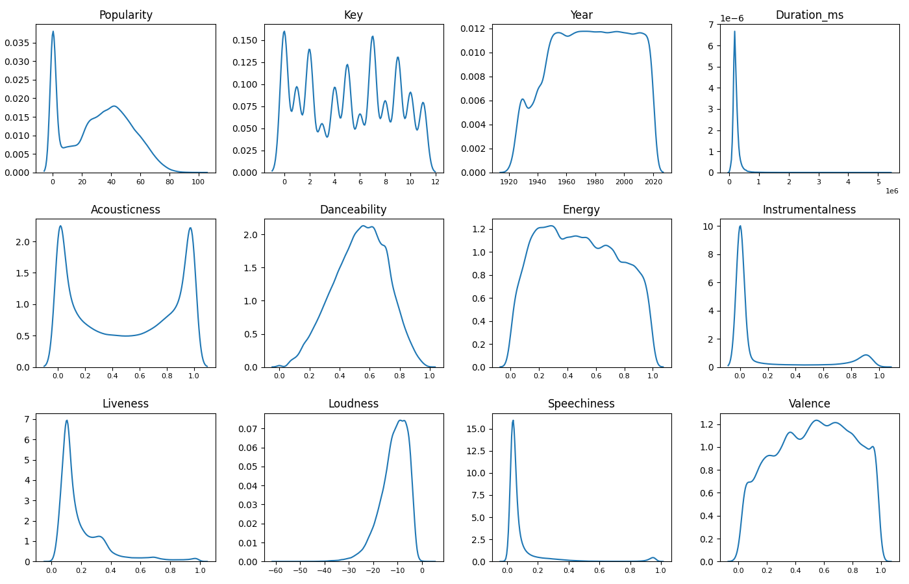

  - Analisando fatotes como a popularidade das músicas em busca de possíveis padrões nos dados

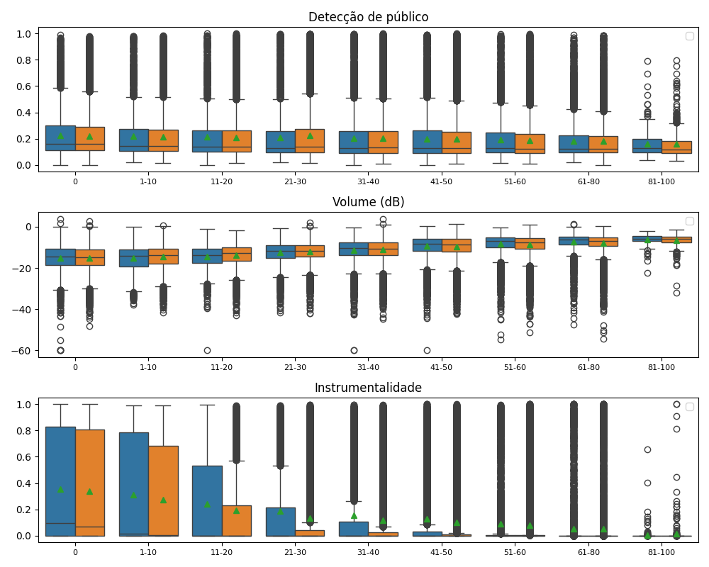
    
- Análises mais aprofundadas nas variáveis

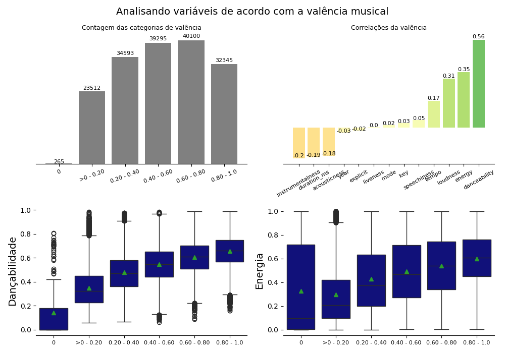

Podemos ver acima por exemplo, que há uma correlação positiva entre valência musical e acusticidade.

------------------

### **01_EDA_pt2**

Nesse notebook realizei alguns tratamentos nas variáveis númericas, incluindo a criação de intervalos para variáveis numéricas.

- Isso com o objetivo de analisar as palavras presentes no nome das das músicas, baseado em um intervalo de valores da coluna, por exemplo, as palavras mais frequêntes quando o nível de instrumentalidade é de 0-0,25 e 0,75-1.
- Obs: Para ajudar na visualização, optei por ocultar algumas palavras que se repetiam muito no nome das músicas, como as conhecidas "wordstops".

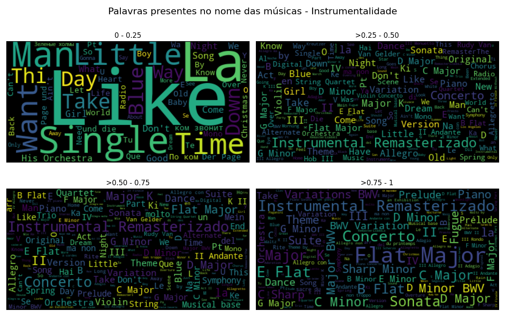

Ao analisarmos essas nuvens, podemos ver a influência do nivel de intrumentalidade nos nomes.

- Agora, a coluna "Energia":

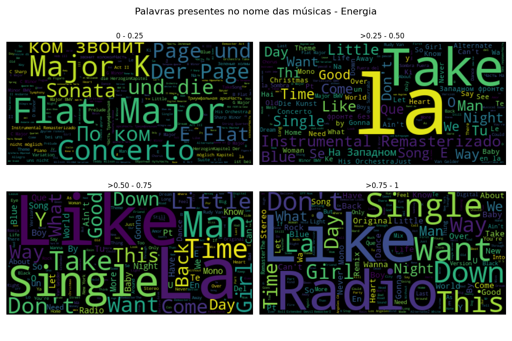

Ao analisarmos as nuvens de "Energia", conseguimos encontrar algumas curiosidades, como: em músicas com níveis mais baixos de energia, palavras como: concerto, flat major e sonata, aparecem com maior frequência do que nas músicas com níveis mais altos.

------------------

### **02_Clusterização**

Nesse notebook fiz a criação de um modelo KMeans utilizando variáveis numéricas contínuas. Aproveitei para:

  - Analisar o uso do PCA em algumas colunas de alta multicolinearidade

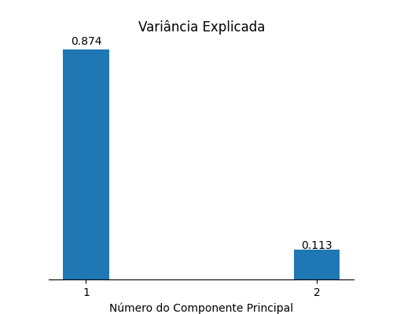

  - Detecção do número de k(grupos) do KMeans com o Elbow Method - Método do Cotovelo
  - 
Obs: Há outras maneiras de se analisar isso, uma delas é o "silhouette_score".

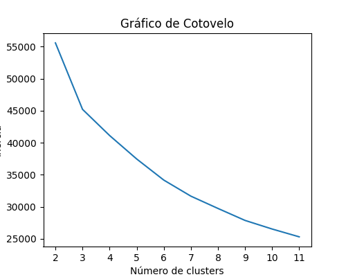

  - Análise das variáveis, através de gráficos de disperção

As cores variam de acordo com o Cluster

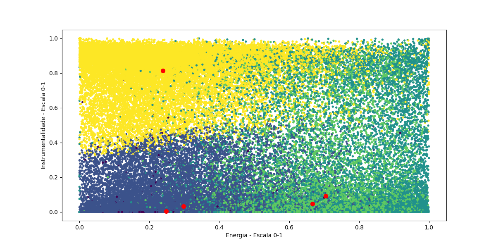

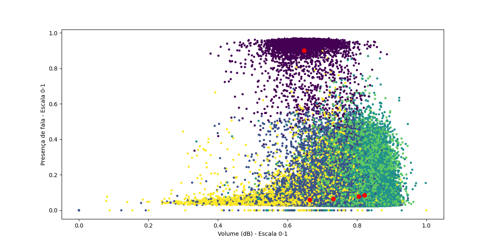
  
  - Visualizações dos quartis e distribuições das colunas, de acordo com os clusters

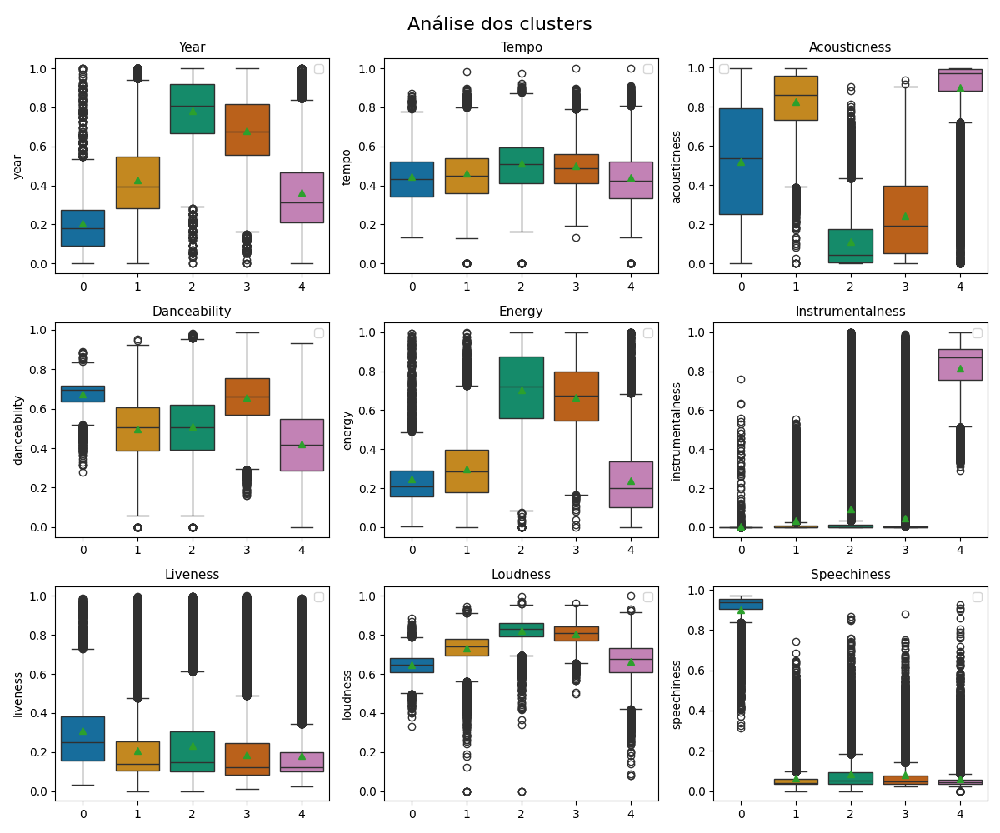

Podemos ver que alguns clusters herdaram características específicas de determinadas colunas, como niveis altos em uma, baixos em outras...

  - Visualização das palavras mais frequentes nos nomes das músicas, baseado nos clusters

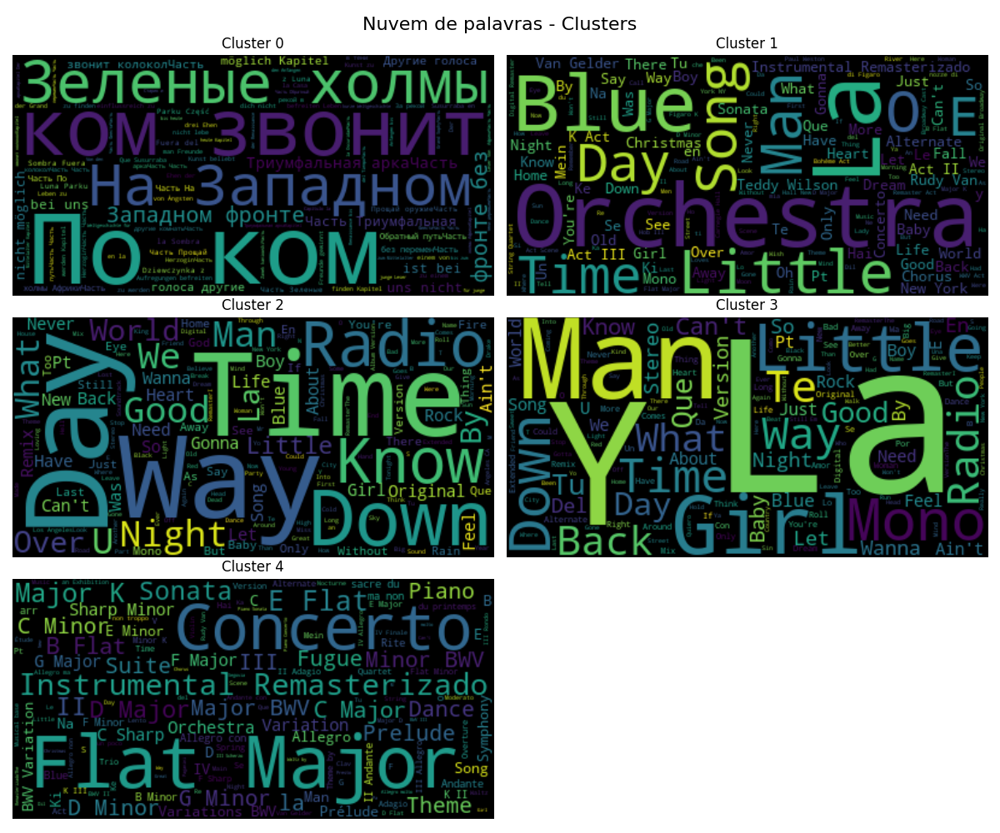
    
Análises detalhadas das colunas, com insights plotados

- Energia

- Acusticidade
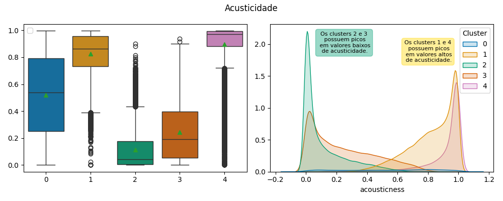

- Valência musical
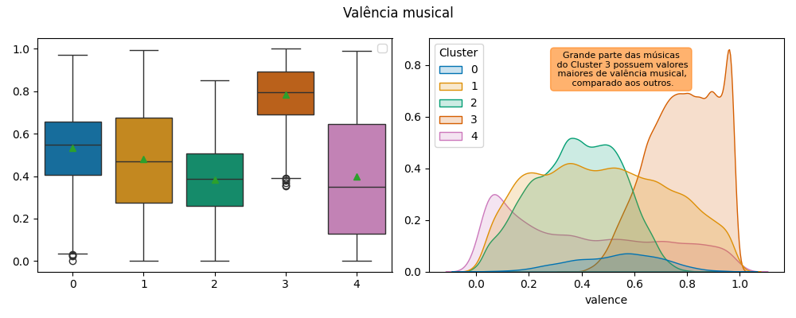

### **Descrição dos clusters:**

Cluster 0:

  - 4672 músicas.
  - Grande parte das músicas lançadas entre as décadas de 30 e 50
  - BPM médio de 111.0
  - Acusticidade média, com mediana de 0,54
  - Dançabilidade média alta, com mediana de 0,70
  - Energia baixa, com mediana de 0,21
  - Instrumentalidade praticamente nula
  - Vivacidade não influencia no cluster
  - Volume (dB) baixo, com mediana de -14,4, indicando grande quantidade de músicas relativamente mais silenciosas
  - Detecção de presença de fala alta, com mediana de 0,94
  - Valência musical moderada, com mediana de 0,54
    
Cluster 1:

  - 48181 músicas.
  - Grande parte das músicas foram lançadas nas décadas de 50 a 80.
  - BPM médio de 114.2
  - Acusticidade alta, com mediana de 0,86
  - Dançabilidade média, com mediana de 0,50
  - Energia baixa, com mediaan de 0,29
  - Instrumentalidade praticamente nula
  - Vivacidade não influencia no cluster
  - Volume (dB) baixo, com mediana de -12,2, indicando grande quantidade de músicas relativamente mais silenciosas
  - Detecção de presença de fala baixo, com mediana de 0,04
  - Valência musical moderada, com grande parte dos valores entre 0,28 e 0,68
    
Cluster 2:

  - 35890 músicas
  - Grande parte das musicas lançadas na década de 90 e acima dos anos 2000
  - BPM médio de 120.3
  - Acusticidade quase nula, com mediana de 0,04
  - Dançabilidade média, com mediana de 0,51
  - Energia média-alta, com mediana de 0,72
  - Instrumentalidade praticamente nula
  - Vivacidade não influencia no cluster
  - Volume (dB) um pouco mais alto que os outros clusters, com mediana de -8, indicando músicas mais altas
  - Detecção de presença de fala baixo, com mediana de 0,05
  - Valência musical moderada, com valores entre 0,26 e 0,51
    
Cluster 3:

  - 41731 músicas
  - Grande parte das músicas lançadas entre a década de 70 e os anos 2000
  - BPM médio de 119.7
  - Acusticidade baixa, com mediana de 0,19
  - Dançabilidade moderada, com mediana de 0,66
  - Energia moderada, com mediana de 0,67
  - Instrumentalidade praticamente nula
  - Vivacidade não influencia no cluster
  - Volume (dB) com mediana de -9,4, indicanndo músicas mais altas
  - Detecção de presença de fala baixo, com mediana de 0,05
  - Valência musical alta, com mediana de 0,79
    
Cluster 4

  - 22625 músicas
  - Grande parte das músicas lançadas entre as décadas de 40 e 70
  - BPM médio de 112.6
  - Acusticidade alta, com mediana de 0,97
  - Dançabilidade média-baixa, com mediana de 0,42
  - Energia baixa, com mediana de 0,20
  - Instrumentalidade alta, com mediana de 0,87
  - Vivacidade não influencia no cluster
  - Volume (dB) baixo, com mediana de -13, indicando grande quantidade de músicas relativamente mais silenciosas
  - Detecção de presença de fala baixa, com mediana de 0,04
  - Valência musical baixa-moderada, com grande parte dos valores distribuidos entre 0,13 e 0,65
 
------------------

### **02_Clusterização_pipeline**

Criação de pipeline com pré-processamento e modelo, incluindo:
  - Seleção das features
  - Normalização dos dados - Escala 0-1
  - Criação do PCA
  - Modelo Kmeans de 5 clusters

Por fim, fiz visualizações nas bases de treinamento e teste.

------------------

### **Script Python: 03_simulando_producao**

Importação do pipeline, e aplicação em cima de um conjunto de dados separado anteriomente. Além de algumas visualizações em cima desses dados.

